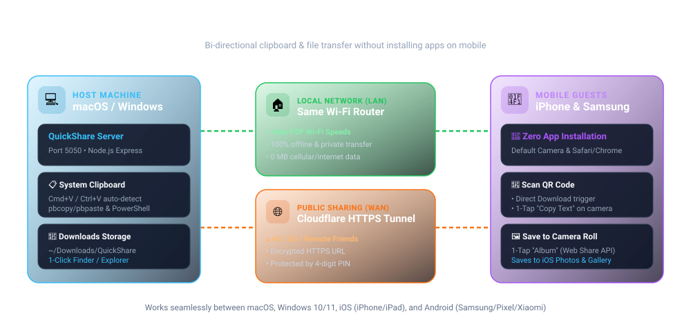
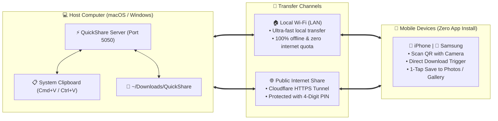

# ⚡ QuickShare — Mac ↔ iPhone | Samsung (LAN & Public Transfer)

<p align="left">
  <a href="https://www.npmjs.com/package/@ngocbaongo/quickshare"></a>
  <a href="https://www.npmjs.com/package/@ngocbaongo/quickshare"></a>
  <a href="https://github.com/ngocbaomobile/quickshare"></a>
  <a href="https://opensource.org/licenses/MIT"></a>
</p>

> Seamless, bi-directional text (clipboard) and file/photo transfer between **macOS**, **Windows**, **iOS (iPhone)**, and **Android (Samsung)** with zero mobile app installation. Works over local Wi-Fi and global Internet via Cloudflare Tunnel.

<p align="center">
  
</p>

---

## 🗺️ How It Works



---

## ✨ Key Features

- 🚫 **Zero Mobile Install:** Works instantly via Camera & Browser (Safari, Chrome).
- ⚡ **Full Local Speed:** Fast Wi-Fi transfer, 100% local, zero internet data consumed.
- 🌐 **Public Share (4G/5G):** Encrypted Cloudflare link secured with a 4-digit PIN.
- 🎯 **Adaptive UI:** Clean, responsive interface tailored for Desktop or Mobile.
- 📸 **Instant QR Download:** Scan with Camera to download files immediately.
- 🔤 **Raw Text QR:** 1-tap copy directly on camera screen without opening a browser.
- 📋 **Instant Clipboard Sync:** Copy & paste text or screenshots via `Cmd+V` / `Ctrl+V`.
- 🖼️ **1-Tap Save to Photos:** Saves directly to iOS Photos & Samsung Gallery.
- 💻 **Cross-Platform:** Native support for both macOS and Windows with 1-click launchers.

---

## ⚡ 1-Step Quick Launch & Install

### 🚀 Instant Run (Zero Setup — macOS, Windows, Linux)
If you have Node.js installed, run this single command to start immediately:
```bash
npx @ngocbaongo/quickshare
```
*Zero installation, zero cloning. Automatically launches the server and opens your browser.*

---

### 🍏 macOS Automated Setup (Creates Desktop Shortcut)
Copy and paste this single command into Terminal:
```bash
curl -fsSL https://raw.githubusercontent.com/ngocbaomobile/quickshare/main/install.sh | bash
```
*Auto-installs Node.js if missing, creates a `QuickShare.command` launcher on your Desktop, registers CLI aliases, and launches the app immediately in your browser.*

### 🪟 Windows (PowerShell)
Copy and paste this single command into PowerShell:
```powershell
iwr -useb https://raw.githubusercontent.com/ngocbaomobile/quickshare/main/install.ps1 | iex
```
*(Or simply download and double-click [**`setup.bat`**](https://raw.githubusercontent.com/ngocbaomobile/quickshare/main/setup.bat))*  
*Auto-installs Node.js LTS via winget, configures Windows Defender Firewall for port 5050, creates a Desktop shortcut, and launches QuickShare automatically.*

---

## 📖 Runbooks & Guides

Detailed step-by-step setup guides, autostart on boot, firewall configuration, and troubleshooting are available:
- 🍏 [**macOS Runbook (RUNBOOK_MACOS.md)**](file:///Users/admin/.gemini/antigravity-ide/scratch/local-quick-share/RUNBOOK_MACOS.md) — Homebrew, `launchd` autostart, macOS CLI, pbcopy/pbpaste.
- 🪟 [**Windows Runbook (RUNBOOK_WINDOWS.md)**](file:///Users/admin/.gemini/antigravity-ide/scratch/local-quick-share/RUNBOOK_WINDOWS.md) — `winget`, `start.bat`, `quickshare.ps1`, Windows Firewall rules, Windows Startup setup.

---

## 🚀 Manual Getting Started

### 1. Prerequisites
- **Node.js** (v18 or higher recommended)
- **macOS** (for native `pbcopy`/`pbpaste` integration)
- **cloudflared** (optional, required only for public internet tunnels):
  ```bash
  brew install cloudflared
  ```

### 2. Installation
Clone the repository and install dependencies:
```bash
git clone https://github.com/ngocbaomobile/quickshare.git
cd quickshare
npm install
```

### 3. Run the Server
```bash
# Start standard server
npm start

# Or run the background launcher
./start.sh
```

---

## 💻 Terminal CLI Setup (macOS)

Add the following aliases to your `~/.zshrc` (or `~/.bashrc`):

```bash
alias quickshare-on="quickshare on"
alias quickshare-off="quickshare off"
alias quickshare="quickshare status"
alias quickshare-public="quickshare-public"
```

Then reload your shell:
```bash
source ~/.zshrc
```

### CLI Usage:
| Command | Description |
| :--- | :--- |
| `quickshare-on` | Launches the server in background and displays local IP, web link, and Terminal QR code |
| `quickshare-off` | Gracefully stops the server and frees port `5050` |
| `quickshare-public` | Starts a secure Cloudflare Tunnel, generates a random 4-digit PIN, and prints the public link & QR |
| `quickshare public off` | Closes the public tunnel while keeping local LAN active |
| `quickshare` | Shows current operational status and connection URLs |

---

## ⚡ Performance Benchmarks & Resource Sizing

QuickShare is engineered for zero bloat, streaming I/O, and low latency. You can run automated benchmarks anytime using `npm run benchmark`.

### 1. Speed & Latency (Real Hardware Measurements)
| Metric / Operation | Latency / Time | Throughput | Notes |
| :--- | :--- | :--- | :--- |
| **API Response (`GET /api/info`)** | **0.49 ms** | 5,450+ req/sec | Sub-millisecond response |
| **Clipboard Read (`pbpaste` / PowerShell)** | **22.80 ms** | — | Native OS system IPC integration |
| **Clipboard Write (`pbcopy` / PowerShell)** | **17.08 ms** | — | Instant cross-device sync |
| **1 MB File (Photo / Screenshot)** | **10.70 ms** | **~93.5 MB/s** | Instant download in 0.01s |
| **10 MB File (High-Res Document)** | **37.58 ms** | **~266.1 MB/s** | Ultra-fast local LAN transfer |
| **50 MB File (Video Clip)** | **88.66 ms** | **~563.9 MB/s** | Full SSD/RAM cache streaming |
| **Concurrency (50 clients)** | **8.02 ms avg** | **5,452 RPS** | High throughput under load |

### 2. Disk Sizing & Footprint
| Component | Actual Size | Comparison / Impact |
| :--- | :--- | :--- |
| **NPM Package Download (`npx` / `.tgz`)** | **20.6 KB** | Lighter than a single icon image |
| **Complete Source Code (UI + Server + CLI)** | **~80 KB** | Vanilla HTML5/CSS/JS, zero bulky frameworks |
| **Production Dependencies (`node_modules`)** | **4.6 MB** | Minimalist stack (Express, Multer, Cors, QR) |
| **Total Disk Installation** | **~5.3 MB** | **50–100× lighter** than Electron apps (200MB–500MB+) |

### 3. Memory (RAM) & CPU Sizing
| Operating State | OS Resident RAM (RSS) | V8 JavaScript Heap | CPU Load | Battery Impact |
| :--- | :--- | :--- | :--- | :--- |
| **Idle Daemon (Background 24/7)** | **~28.9 MB** | **5.78 MB** | **0.0%** | Zero drain (kernel sleeps process) |
| **Active 50 MB File Transfer** | **~49.3 MB** | **~12.4 MB** | **~1.5%–3.0%** | Minimal burst during transfer |
| **Post-Transfer (GC Recovery)** | Drops back to ~29 MB | Instant release | **0.0%** | No memory leaks (stream-based) |

> 💡 **Disk Streaming Architecture:** Uploads stream directly to `~/Downloads/QuickShare` chunk by chunk via Multer disk storage, preventing memory bloat even when transferring gigabyte-sized files.

---

## 📂 File Storage
By default, all uploaded photos and files sent from mobile devices are saved directly to:
```
~/Downloads/QuickShare
```
The Mac web interface includes a **Finder** button to open this directory instantly in macOS Finder.

---

## 🛠️ Technology Stack
- **Backend:** Node.js, Express, Multer, `qrcode-terminal`, Cloudflare Tunnel (`cloudflared`)
- **Frontend:** Vanilla HTML5, Modern CSS (Glassmorphism & Dark Mode), Modern JavaScript (Clipboard API, Web Share API, HTML5 Drag & Drop)
- **Supported Platforms:** macOS, iOS (Safari), Android (Samsung Internet, Google Chrome)

---

## 📄 License
MIT License. Free to use, modify, and distribute.
